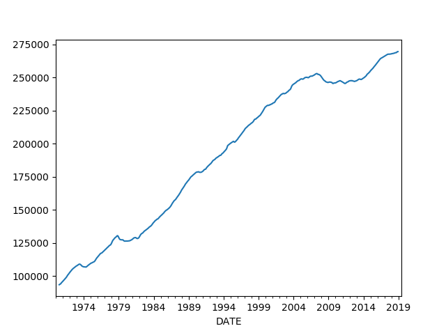

# RNN-TimeSeries-VehicleMilesTravelled
Plot of Vehicle miles travelled over time

The plot seems to be having seasonal component along with trend and residual components.

Trend part of the residual component

Seasonal component of the decomposed

Residual part of the distribution

Newral Network model was devlooped using RNN with Tensorflow and tested with the test data. Following is the test Loss of the model

Original vs predicted values of the test dataset is platted below. The model seems to be very accurate.

